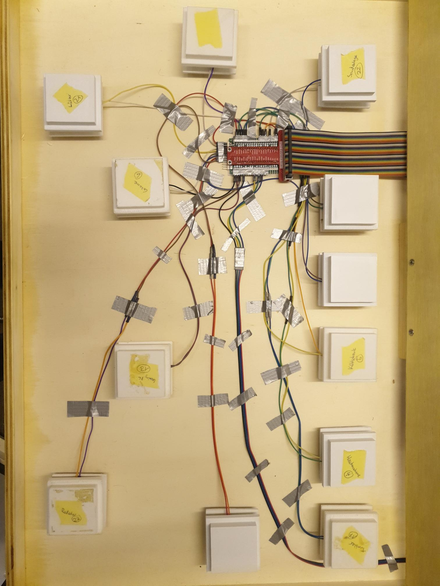
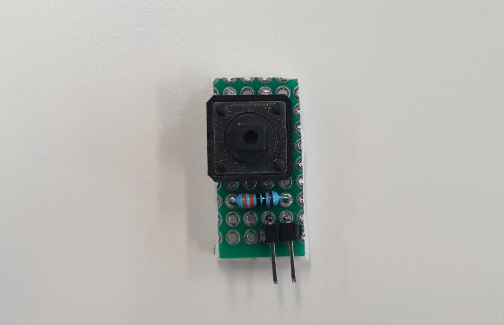
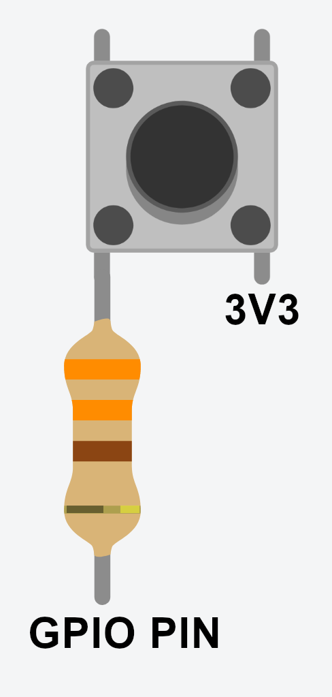
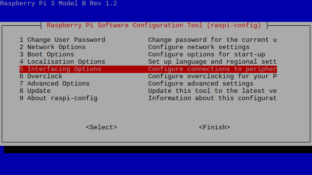
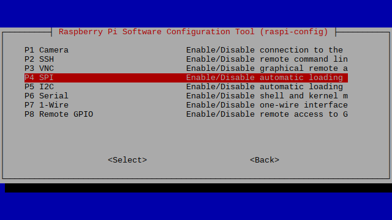
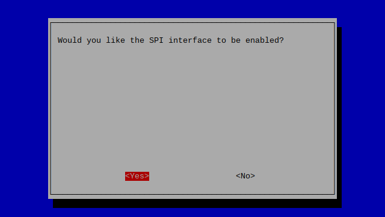
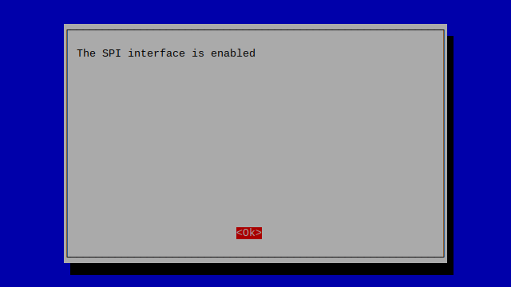
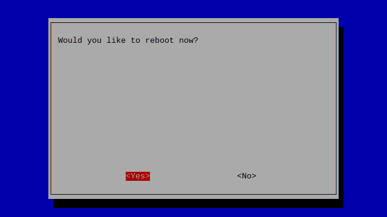

# Hardware Dokumentation - IP12 Solaranlage

- [Hardware Dokumentation - IP12 Solaranlage](#hardware-dokumentation---ip12-solaranlage)
- [Hardware](#hardware)
  * [Gehäuse](#geh-use)
  * [Elektronik](#elektronik)
    + [Hardware Spezifikation](#hardware-spezifikation)
    + [Buttons](#buttons)
      - [Buttonplatine](#buttonplatine)
    + [Monitor](#monitor)
  * [Buttons](#buttons-1)
- [Software](#software)
  * [Installation](#installation)
    + [Vorbereitung](#vorbereitung)
    + [Installation der Software](#installation-der-software)
    + [Projekt Repository Installieren](#projekt-repository-installieren)
    + [Autostart der Applikation](#autostart-der-applikation)
  * [Konfiguration](#konfiguration)
    + [Einführung](#einf-hrung)
    + [Beispielskonfiguration](#beispielskonfiguration)
      - [Game Konfiguration](#game-konfiguration)
      - [Zufallsnamen](#zufallsnamen)
      - [Levelkonfiguration](#levelkonfiguration)
      - [Nutzer*innen Konfiguration](#nutzer-innen-konfiguration)

# Hardware

## Gehäuse

Das Gehäuse ist aus 10 mm dickem Sperrholz aus Pappel gebaut. Die einzelnen Platten haben wir folgendermassen ausgesägt.


## Elektronik

### Hardware Spezifikation

- Raspberry Pi 4
- Male Micro HDMI -> Female HDMI Adapter
- HDMI Kabel
- 2x 120mm Computer Lüfter
- 12 Volt Netzteil für Lüfter
- 12x 330Ω Widerstände
- 12x kleine 4 PIN Buttons (Haushaltsgeräte)
- 4x 2 PIN Arcade Buttons
- 2x 3-Phasen Kaltgerätekabel
- Dupont Kabel für Verbindung der Buttons


### Buttons


Die Buttons für die "Haushaltsgeräte" sowie die vier Menubuttons schliessen wir über die GPIO (für engl. General Purpose Input/Output, wörtlich Allzweckeingabe/-ausgabe) Pins des Raspberry Pi an. Dabei nutzen wir folgende PINs für die jeweiligen Buttons.

| GPIO | Button              |
| ---- | ------------------- |
| 4    | Soundanlage         |
| 5    | Geschirrspühler     |
| 6    | Tumbler             |
| 13   | Radiator            |
| 16   | Fernseher           |
| 17   | Kühlschrank         |
| 19   | Waschmaschine       |
| 20   | Gaming PC           |
| 21   | Gitarre und Amp     |
| 22   | Herd                |
| 26   | Ventilator          |
| 27   | TV und Spielkonsole |
| 23   | Menü Button 2       |
| 24   | Menü Button 1       |
| 25   | Menü Button 3       |
| 12   | Menü Button 4       |

Diese Konfiguration der Buttons wird dynamisch vor jedem Level aus der Level Konfigurationsdatei (z.B. "src/main/resources/ch/fhnw/solar/simulator/level_config/level1.properties") gelesen. Bei der obigen Liste handelt es sich lediglich um die vorgeschlagene Konfiguration.


Die Buttons sind folgendermassen angehängt:




#### Buttonplatine



Die Buttonplatinen sind nach folgendem Schema gelötet:




### Monitor

Es ist ein 23" Monitor verbaut, welcher über HDMI und einem Micro-HDMI Kabel an dem Raspberry Pi angeschlossen ist.


## Buttons

Die elektrischen Geräte sind alle 3D-gedruckt.

Die STL-Dateien finden Sie hier:

| Button              | STL                                                   |
| ------------------- | ----------------------------------------------------- |
| Soundanlage         | [Soundanlage.stl](assets/stl/Soundanlage.stl)         |
| Geschirrspühler     | [Geschirrspühler.stl](assets/stl/Geschirrspühler.stl) |
| Tumbler             | [Tumbler.stl](assets/stl/Tumbler.stl)                 |
| Radiator            | [Radiator.stl](assets/stl/Radiator.stl)               |
| Fernseher           | [Fernseher.stl](assets/stl/Fernseher.stl)             |
| Kühlschrank         | [Kühlschrank.stl](assets/stl/Kühlschrank.stl)         |
| Waschmaschine       | [Waschmaschiene.stl](assets/stl/Waschmaschiene.stl)   |
| Gaming PC           | [PC-Game.stl](assets/stl/PC-Game.stl)                 |
| Gitarre und Amp     | [GitarreAmp](assets/stl/GitarreAmp)                   |
| Herd                | [Herd-Ofen.stl](assets/stl/Herd-Ofen.stl)             |
| Ventilator          | [Ventilator.stl](assets/stl/Ventilator.stl)           |
| TV und Spielkonsole | [Konsole-TV.stl](assets/stl/Konsole-TV.stl)           |


# Software

## Installation

### Vorbereitung

1. **Raspberry Pi OS vorbereiten**

Stelle sicher, dass du die neueste Version des Raspberry Pi OS auf deinem Raspberry Pi installiert hast. Du kannst das offizielle Raspberry Pi OS [hier](https://www.raspberrypi.org/software/operating-systems/) herunterladen und installieren.

2. **Verbindung zum Raspberry Pi herstellen**

Stelle eine Verbindung zu deinem Raspberry Pi her. Du kannst dies entweder über ein HDMI-Kabel und eine Tastatur/Maus oder über SSH tun.

3. **SPI auf dem Raspberry PI aktivieren**

Um auf die PINs des Raspberry PIs zugreifen zu können müssen wir das SPI Protokoll aktivieren. Dies geschieht folgendermassen:

```bash
sudo raspi-config
```

Dies öffnet die Raspi-Config App. Wähle "Interfacing Options".

 

Markiere SPI und selektiere "Select"



Selektiere "Yes"



Selektiere "OK"



Selektiere "Yes" um den Raspberry Pi neu zustarten.




### Installation der Software

1. **Java JDK installieren**

Aktualisiere zunächst deine Paketlisten mit dem Befehl:

```bash
sudo apt update
```

Installiere dann das OpenJDK 11 (Java Development Kit) mit dem Befehl:

```bash
wget -O openjfx.zip https://gluonhq.com/download/javafx-17-ea-sdk-linux-arm32/
unzip openjfx.zip
sudo mv javafx-sdk-17/ /opt/javafx-sdk-17/
```

Überprüfe die Installation und die Version mit dem Befehl:

```bash
java -version
```

2. **Maven installieren**

Installiere Maven mit dem Befehl:

```bash
sudo apt install maven
```

Überprüfe die Installation und die Version mit dem Befehl:

```bash
mvn -version
```


### Projekt Repository Installieren

1. **Code klonen**

Klone den Code vom GitLab der FHNW auf den Desktop.

```bash
cd Desktop
git clone git@github.com:fhnw-sgi-ip12-22vt/ip12-22vt_solaranlage.git
```

2. **Programm kompilieren**

Gehe in das Verzeichnis deines Projekts und führe den folgenden Befehl aus, um dein Programm zu kompilieren:

```bash
cd ip12-22vt_solaranlage
mvn clean install
```

3. Programm ausführen
    Das Build-Script hat die Kompilierten Dateien nach `target/` verschoben.

  Im Ordner `target/distribution/` befindet das `run.sh` Script, dieses soll mit sudo Rechten ausgeführt werden um auf die Hardware des Pis zugreifen zu können.

  ```bash
  cd target/distribution
  sudo ./run.sh
  ```

Das war's! Jetzt solltest du in der Lage sein, die Software des Solarsimulator mit Maven, Java, Pi4J und JavaFX auf einem Raspberry Pi 4 zu erstellen und auszuführen.


### Autostart der Applikation

Damit die Applikation automatisch gestartet werden kann richten wir einen CronJob ein, welcher das aktuelle build Script ausführt.

1. Öffnen Sie zuerst das Terminal Ihres Raspberry Pi.

2. Geben Sie `sudo crontab -e` ein, um den Cron-Tab des Superbenutzers zu öffnen.
   Wenn Sie zum ersten Mal crontab ausführen, wird Sie das System fragen, welchen Texteditor Sie verwenden möchten. Sie können `nano` wählen, da es ziemlich benutzerfreundlich ist.

3. Gehen Sie ans Ende des Crontab-Datei und fügen Sie die folgende Zeile hinzu:

```bash
@reboot sudo /pfad/zum/ihrem_skript.sh
```

4. Ersetzen Sie `/pfad/zum/ihrem_skript.sh` mit dem tatsächlichen Pfad zu Ihrem Skript. Wenn Sie die Anleitung befolgt haben sollte dies folgender Pfad sein:`/home/pi/Desktop/ip12-22vt_solaranlage/target/distribution/run.sh`

5. Speichern und schließen Sie die Datei. Wenn Sie `nano` als Editor ausgewählt haben, können Sie dies tun, indem Sie `Ctrl+X` drücken, dann `Y` eingeben, um zu bestätigen, dass Sie speichern möchten, und schließlich `Enter` drücken, um den bestehenden Dateinamen zu bestätigen.

6. Nach einem Neustart Ihres Raspberry Pi sollte nun Ihr Skript ausgeführt werden. Beachten Sie bitte, dass das Skript ausführbare Berechtigungen haben muss. Wenn es diese nicht hat, können Sie sie mit dem folgenden Befehl hinzufügen:

```
sudo chmod +x /pfad/zum/ihrem_skript.sh
```

7. Ersetzen Sie auch hier `/pfad/zum/ihrem_skript.sh` mit dem tatsächlichen Pfad zu Ihrem Skript.


## Konfiguration

Der Solarsimulator wurde mit dem Hintergedanken entwickelt, dass einfache Anpassungen direkt über Konfigurationsdateien eingestellt werden können und somit der Source Code nicht angepasst werden muss.

Die Konfigurations-Dateien befinden sich in unter `src/main/resources/ch/fhnw/solar/simulator` und werden nach dem Build nach `target/classes/ch/fhnw/solar/simulator` kopiert.


### Einführung

Es können folgende Konfigurationen vorgenommen werden:

- Game Konfiguration

  In der Game Konfiguration (gameTextDe.properties) können alle Textelemente des User Interfaces angepasst werden. Diese Konfigurationsdatei ist für die Deutsche Sprache. Es können mehrere Konfigurationsdateien mit Texten in verschiedenen Sprachen angelegt werden.

  Pfade: `src/main/resources/ch/fhnw/solar/simulator/game_config/`***[`gameTextDe.properties`, `gameTextEn.properties`]***
  Pfad nach dem build: `target/classes/ch/fhnw/solar/simulator/game_config/`***[`gameTextDe.properties`, `gameTextEn.properties`]***

- Zufallsnamen Generator

  Die Zufallsnamen nach jedem gespielten Spiel, welche für die Highscoreliste gebraucht werden, sind vordefiniert.

  Pfad: `src/main/resources/ch/fhnw/solar/simulator/game_config/names.properties`
  Pfad nach dem build: `target/classes/ch/fhnw/solar/simulator/game_config/names.properties`

- Levelkonfiguration

  Die einzelnen Levels können einzeln konfiguriert werden. Dazu müssen pro Level jeweils ein 'level**{Level Nummer}**' erstellt werden.

  In der Levelkonfiguration können folgende Einstellungen getroffen werden:

  - Name des Levels
  - Ablauf der Stromproduktions Kurve
  - Geräte und deren Verbrauchseigenschaften
  - Verlauf der Hintergrundfarben

  Pfade: `src/main/resources/ch/fhnw/solar/simulator/level_config/` `level` ***[ `1`, `2`, `3` ]***`.properties`
  Pfade nach dem build: `target/classes/ch/fhnw/solar/simulator/level_config/` `level` ***[ `1`, `2`, `3` ]***`.properties`

- Nutzer*innen Konfiguration

  In der Nutzer*innen Konfiguration sind die Highscores abgelegt. Dazu gehören jeweils das Datum/Zeit, die Punktzahl sowie den Zufallsnamen.
  Diese Datei wird benötigt um den Highscore am Ende eines abgeschlossenen Levels anzuzeigen.

  Pfade: `src/main/resources/ch/fhnw/solar/simulator/user_config/` `userDataLevel` ***[ `1`, `2`, `3` ]*** `.properties`
  Pfade nach dem build: `target/classes/ch/fhnw/solar/simulator/user_config/` `userDataLevel` ***[ `1`, `2`, `3` ]*** `.properties`


### Beispielskonfiguration

#### Game Konfiguration

In der Game Konfiguration werden alle Texte für das User Interface definiert.

Das Schema für die Konfiguration ist folgendes:

> [variable]`=`[Text als String]

``` properties
# Right Menu
backButtonText=Zurück
# Score Menu
scoreText=Score:
# LevelView
levelTitleText1=Sommer Tag
levelTitleText2=Winter Tag
levelTitleText3=Regen Tag
levelButtonText=Levels
helpButtonText=Hilfe
pauseButtonText=Pause
restartButtonText=Neustart
# LevelSelectView
levelSelectTitle=Level auswahl
rightButtonText=Rechts
leftButtonText=Links
selectButtonText=Auswählen
level1ButtonText=Sommer Tag
level2ButtonText=Winter Tag
level3ButtonText=Regen Tag
# PreScoreView
preScoreTitle=Hier sind deine Punkte
confirmButtonText=Bestätigen
randomNameButtonText=Zufallsname
pointsLabel=Punkte:
missingGoalsLabel=Punktabzug wegen nicht erreichter Ziele (pro Ziel 2000 Punkte):
endPointsLabel=Endpunkte:
levelLabel=Level:
randomNameLabel=Zufallsname:
# ScoreView
scoreTitle=Punkte Tabelle
playAgainButtonText=Spiel erneut
chooseLevelButtonText=Level auswählen
positionColumn=Position
nameColumn=Name
pointsColumn=Punkte
levelColumn=Level
upButtonText=Nach Oben
downButtonText=Nach Unten
# InfoView
infoTitle=Anleitung
welcomeText=Herzlich willkommen zum Solarsimulator!
gameExplanation1=In diesem Spiel geht es darum, den Stromverbrauch deines Einfamilienhauses zu optimieren und dabei verschiedene private Elektrogeräte zu verwenden, um so viel Energie wie möglich von der Photovoltaikanlage zu verbrauchen.
rulesTitle=Hier sind die Regeln:
rule1=Ziel des Spiels ist es, möglichst viele Punkte zu sammeln, indem du den Stromverbrauch des Einfamilienhauses optimierst und dabei so viel erneuerbare Energie wie möglich verwendest.
rule2=Du startest das Spiel in einem Einfamilienhaus und einer Kurve, die den Einfluss vom Solarstrom zeigt. Diese Kurve zeigt die Menge an Strom an, die zu bestimmten Tageszeiten verfügbar ist.
rule3=Um Geräte einzuschalten, musst du sie anklicken. Je mehr Geräte du einschaltest, desto mehr Punkte bekommst du. Aber Vorsicht: Wenn du zu viel Strom verbrauchst, verlierst du Punkte.
rule4=Du musst die Geräte innerhalb der Kurve einschalten. Wenn du Geräte einschaltest, wenn kein Solarstrom verfügbar ist, verlierst du ebenfalls Punkte.
rule5=Es gibt verschiedene Arten von Geräten, die unterschiedliche Mengen an Strom verbrauchen. Zum Beispiel verbraucht ein Fernseher mehr Strom als eine Glühbirne. Wähle also weise aus, welche Geräte du einschaltest.
rule6=Um zu gewinnen, musst du versuchen, so viele Geräte wie möglich innerhalb der Kurve einzuschalten und dabei die maximale Menge an Energie zu nutzen. Zusätzlich sollte jedes Gerät eine gewisse Zeit lang eingeschaltet werden.
rule7=Beachte, dass der Stromfluss von der Sonnenaktivität und der Wetterlage beeinflusst wird. An sonnigen Tagen fliesst mehr Solarstrom als an bewölkten Tagen.
rule8=Manche Geräte müssen dauerhaft eingeschaltet sein, wie der Kühlschrank, während andere nur bei Bedarf aktiviert werden müssen, wie die Gitarre. Achte darauf, die richtigen Geräte zur richtigen Zeit einzuschalten, um den optimalen Stromverbrauch zu erzielen.
closingText=Viel Spass beim Spielen und Entdecken der Welt der erneuerbaren Energien!
```


#### Zufallsnamen

Die Zufallsnamen können beliebig gewählt werden und in der Konfigurationsdatei definiert werden.

Schema der Konfiguration

> `name`[Fortlaufende Nummerierung als int]`=`[Name als String]

**Beispiel Namesliste**

``` properties
name1=Bouncy
name2=Sparkles
name3=Sunshine
name4=Whiskers
name5=Twinkles
name6=Fluffy
name7=Starlight
name8=Rosy
name9=Cupcake
name10=Jellybean
```


#### Levelkonfiguration

Hier können in den vier Abschnitten alle Einstellungen für das Level eingestellt werden.

- Name
  Die Konfiguration um den Namen des Levels zu definieren ist folgendermassen:

  > `name=`[Name des Levels als String]

- Kurve für die Stromproduktion

  Die Konfiguration für einen Datenpunkt für Kurve der Stromproduktion sieht folgendermassen aus:

  > `datePoint`[fortlaufende Nummerierung als int]`=`[Zeit in Stunden als double]`;`[Produktion in Watt als double]

- Elektrische Haushaltsgeräte / Knöpfe
  Die Konfiguration für ein Gerät sieht folgendermassen aus:

  > `device`[Gerätenummer als int]`=`[Name als String]`;`[PIN Raspberry Pi als int]`;`[Typ als String]`;`[Anzahl Wiederholungen als int]`;`[Standby als int]`;`[Ende der ersten Periode in Stunden als double]`;`[Verbrauch erste Periode in Watt als double]`;`[Ende der zweiten Periode als double]`;`...
  >
  > `goal`[Gerätenummer als int]`=`[anz. Stunden welche das Gerät laufen muss (als double)]

- Hintergrundfarbe
  Es können 20 verschiedene Farbtöne bestimmt werden, welche im Hintergrund als Animation ablaufen.
  Die Konfiguration für einen Datenpunkt sieht folgendermassen aus:

  > `color`[Vortlaufende Nummerierung (1-20) als int]`=#`[[Farbcode in Hex](https://de.wikipedia.org/wiki/Hexadezimale_Farbdefinition)]


**Beispielkonfiguration für das Level 1 (Sonnentag)**

```properties
#
# Konfigurationsdateien für die Elemente in Level 1
#
# Wenn mehrere Elemente pro Zeile definiert sind, werden
# sie mit ; getrennt bsp. element1;element2
#
# Level 1 Name
name=Level 1
#
# Level 1 Datenpunkte wo die Stromproduktion durchläuft
dataPoint1=6.0;100.0
dataPoint2=7.0;400.0
dataPoint3=8.0;1000.0
dataPoint4=9.0;2800.0
dataPoint5=10.0;4000.0
dataPoint6=11.0;4700.0
dataPoint7=12.0;5000.0
dataPoint8=13.0;5100.0
dataPoint9=14.0;5100.0
dataPoint10=15.0;5000.0
dataPoint11=16.0;4700.0
dataPoint12=17.0;4000.0
dataPoint13=18.0;2800.0
dataPoint14=19.0;1000.0
dataPoint15=20.0;400.0
dataPoint16=21.0;100.0
dataPoint17=22.0;0.0
#
# Level 1 Geräte (Name;PIN Raspberry Pi; Typ;Anzahl Wiederholungen;
#       Standby;Ende der ersten Periode;Verbrauch erste Periode;
#       Ende der zweiten Periode;...)
#
# Wichtig: Wenn es Wiederholungen gibt, wird die Zeit nicht
#       aufsummiert -> 0.25;..;0.25 anstatt 0.25;..;0.5
#
device1=Waschmaschine;6;FIXED_TIME_ON;0;0;0.08;200;0.38;4000;0.9;200;0.98;500;1.15;200;1.23;500;1.40;200;1.48;500
goal1=1.25
device2=Herd;22;PARTLY_ON;0;1999;2.5;2000
goal2=1.0
device3=Tumbler;19;FIXED_TIME_ON;0;499;2.5;500
goal3=0.0
device4=Kuehlschrank;17;ALWAYS_ON;32;0;0.18;75;0.34;1
goal4=0.0
device5=Soundanlage;4;PARTLY_ON;0;99;2.5;100
goal5=0.0
device6=Radiator;13;PARTLY_ON;0;899;2.5;900
goal6=0.0
device7=Fernseher;16;PARTLY_ON;0;149;2.5;150
goal7=0.0
device8=Gaming PC;20;PARTLY_ON;0;499;2.5;500
goal8=1.5
device9=Gitarre;21;PARTLY_ON;0;19;2.5;20
goal9=0.5
device10=Geschirrspueler;5;FIXED_TIME_ON;0;0;0.5;20;0.67;2000;1.5;20;1.58;2000;1.93;50;3.0;20
goal10=3.0
device11=Ventilator;26;PARTLY_ON;0;49;4.5;50
goal11=4.0
device12=TV und Spielkonsole;27;PARTLY_ON;0;99;2.5;100
goal12=0.0
#
# Level 1 Farben zur Synchronisierung des Hintergrundes
#
color1=#00010C
color2=#000B21
color3=#001057
color4=#02168C
color5=#0A1E9C
color6=#1426AB
color7=#2C3AA7
color8=#454EA2
color9=#454EA2
color10=#454EA2
color11=#454EA2
color12=#454EA2
color13=#5351A9
color14=#653E97
color15=#553184
color16=#4D297B
color17=#382253
color18=#25113D
color19=#160826
color20=#0F021E
```


#### Nutzer*innen Konfiguration

Diese Konfiguration wird für den Highscore verwendet und sollte nicht manuell angepasst werden müssen.

Beispiel:

```properties
#Wed Jun 07 10:12:53 CEST 2023
2023-05-18T06\:13\:21.847598Z=16782,Jubilee
2023-05-12T06\:43\:24.704944800Z=4026,Bouncy
2023-05-24T08\:40\:05.446922Z=17593,Snowball
2023-05-12T06\:40\:20.829186Z=2827,Snowball
2023-05-31T09\:05\:13.448247900Z=19775,Sunshine
```

