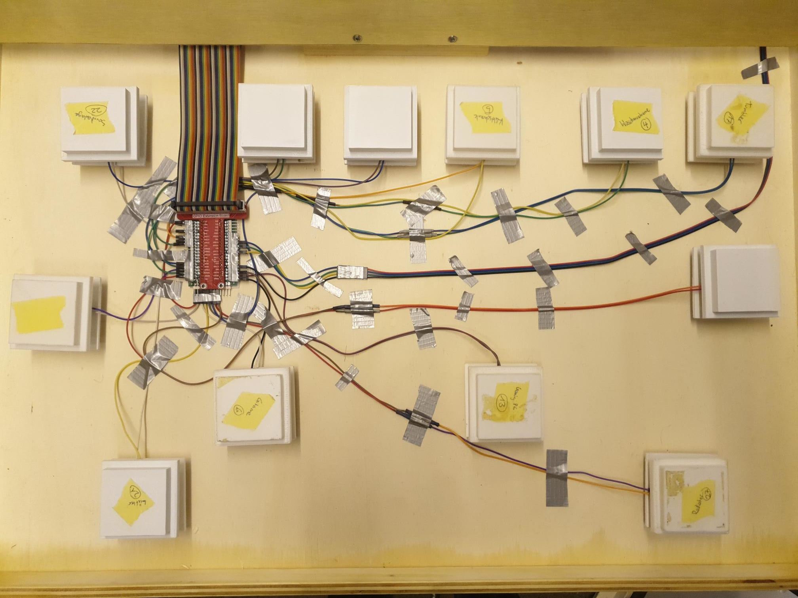

# Hardware Dokumentation - IP12 Solaranlage

[TOC]

# Hardware

## Gehäuse

Das Gehäuse ist aus 10 mm dickem Sperrholz aus Pappel gebaut. Die einzelnen Platten haben wir folgendermassen ausgesägt.


## Elektronik

### Hardware Spezifikation

- Raspberry Pi 4
- Male Micro HDMI -> Female HDMI Adapter
- HDMI Kabel
- 2x 120mm Computer Lüfter
- 12 Volt Netzteil für Lüfter
- 12x 10kΩ Widerstände
- 12x kleine 4 PIN Buttons (Haushaltsgeräte)
- 4x 2 PIN Arcade Buttons
- 2x 3-Phasen Kaltgerätekabel
- Regenbogenkabel für Verbindung Buttons


### Buttons


Die Buttons für die "Haushaltsgeräte" sowie die vier Menubuttons schliessen wir über die GPIO (für engl. General Purpose Input/Output, wörtlich Allzweckeingabe/-ausgabe) Pins des Raspberry Pi an. Dabei nutzen wir folgende PINs für die jeweiligen Buttons.

| GPIO | Button              |
| ---- | ------------------- |
| 4    | Soundanlage         |
| 5    | Geschirrspühler     |
| 6    | Tumbler             |
| 13   | Radiator            |
| 16   | Fernseher           |
| 17   | Kühlschrank         |
| 19   | Waschmaschine       |
| 20   | Gaming PC           |
| 21   | Gitarre und Amp     |
| 22   | Herd                |
| 26   | Ventilator          |
| 27   | TV und Spielkonsole |
| 23   | Menü Button 2       |
| 24   | Menü Button 1       |
| 25   | Menü Button 3       |
| 12   | Menü Button 4       |

Diese Konfiguration der Buttons wird dynamisch vor jedem Level aus der Level Konfigurationsdatei (z.B. "src/main/resources/ch/fhnw/solar/simulator/level_config/level1.properties") gelesen. Bei der obigen Liste handelt es sich lediglich um die vorgeschlagene Konfiguration.


#### Buttonplatine





### Monitor

Es ist ein 23" Monitor verbaut, welcher über HDMI und einem Micro-HDMI Kabel an dem Raspberry Pi angeschlossen ist.


# Software

## Installation

### Vorbereitung

1. **Raspberry Pi OS vorbereiten**

Stelle sicher, dass du die neueste Version des Raspberry Pi OS auf deinem Raspberry Pi installiert hast. Du kannst das offizielle Raspberry Pi OS [hier](https://www.raspberrypi.org/software/operating-systems/) herunterladen und installieren.

2. **Verbindung zum Raspberry Pi herstellen**

Stelle eine Verbindung zu deinem Raspberry Pi her. Du kannst dies entweder über ein HDMI-Kabel und eine Tastatur/Maus oder über SSH tun.

3. **SPI auf dem Raspberry PI aktivieren**

Um auf die PINs des Raspberry PIs zugreifen zu können müssen wir das SPI Protokoll aktivieren. Dies geschieht folgendermassen:

```bash
sudo raspi-config
```

Dies öffnet die Raspi-Config App. Wähle "Interfacing Options".
 

Markiere SPI und selektiere "Select"


Selektiere "Yes"


Selektiere "OK"


Selektiere "Yes" um den Raspberry Pi neu zustarten.


### Installation der Software

1. **Java JDK installieren**

Aktualisiere zunächst deine Paketlisten mit dem Befehl:

```bash
sudo apt update
```

Installiere dann das OpenJDK 11 (Java Development Kit) mit dem Befehl:

```bash
wget -O openjfx.zip https://gluonhq.com/download/javafx-17-ea-sdk-linux-arm32/
unzip openjfx.zip
sudo mv javafx-sdk-17/ /opt/javafx-sdk-17/
```

Überprüfe die Installation und die Version mit dem Befehl:

```bash
java -version
```

2. **Maven installieren**

Installiere Maven mit dem Befehl:

```bash
sudo apt install maven
```

Überprüfe die Installation und die Version mit dem Befehl:

```bash
mvn -version
```


### Projekt Repository Installieren

1. **Code klonen**

Klone den Code vom GitLab der FHNW auf den Desktop.

```bash
cd Desktop
git clone git@gitlab.fhnw.ch:ip12-22vt/ip12-22vt_solaranlage/solaranlage_prod.git
```

2. **Programm kompilieren**

Gehe in das Verzeichnis deines Projekts und führe den folgenden Befehl aus, um dein Programm zu kompilieren:

```bash
cd solaranlage_prod
mvn clean install
```

3. Programm ausführen
    Das Build-Script hat die Kompilierten Dateien nach `target/` verschoben.

  Im Ordner `target/distribution/` befindet das `run.sh` Script, dieses soll mit sudo Rechten ausgeführt werden um auf die Hardware des Pis zugreifen zu können.

  ```bash
  cd target/distribution
  sudo ./run.sh
  ```

Das war's! Jetzt solltest du in der Lage sein, die Software des Solarsimulator mit Maven, Java, Pi4J und JavaFX auf einem Raspberry Pi 4 zu erstellen und auszuführen.